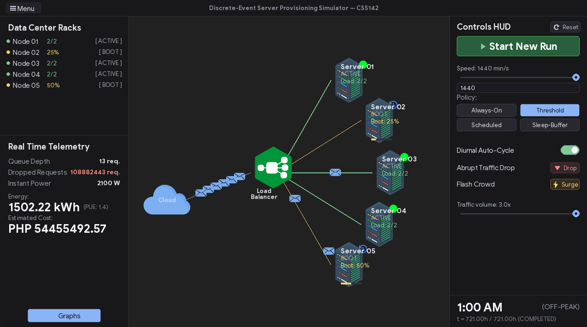
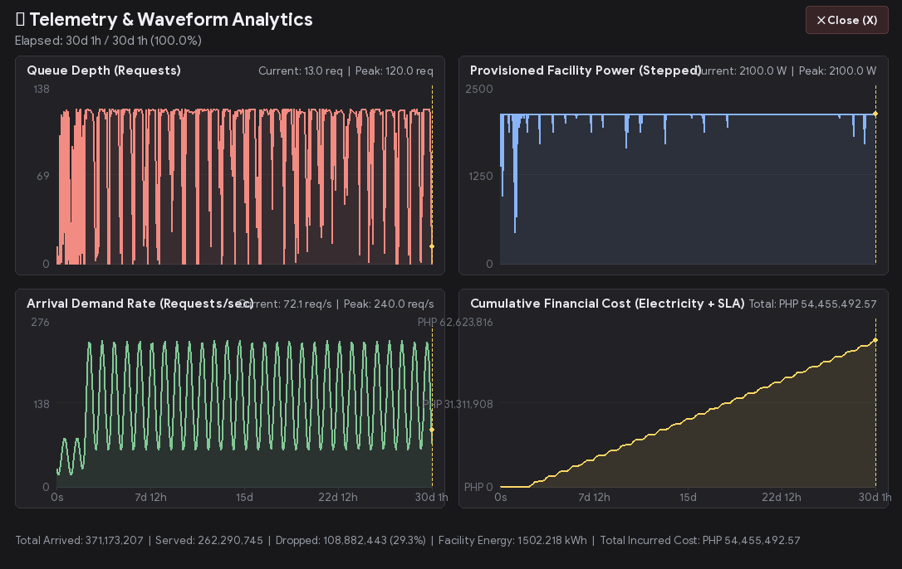

# Data Center Server Provisioning Simulation

A Discrete-Event Simulation (DES) modeling server provisioning policies, cold-boot penalties, and energy costs under diurnal and flash-crowd traffic surges.



## Overview
Large-scale data center operators face direct financial trade-offs between electricity costs and request handling performance:
- **Idle servers** consume 50% to 70% of their peak power draw.
- **Powering down servers** cuts electricity waste, but transitioning servers from powered-off states introduces significant physical **cold-boot delays** (minutes), during which sudden traffic surges cause request queue buildup, severe latency degradation, or dropped packets.

This project implements a discrete-event simulation model in Python (leveraging SimPy and Pygame) to evaluate and compare four dynamic provisioning policies:
1. **Always-On (Baseline)**: Over-provisioned baseline keeping nodes powered 24/7.
2. **Threshold-Based**: Reactive scaling based on queue depth upper/lower watermarks.
3. **Scheduled Provisioning**: Predictive scaling pre-warming nodes ahead of diurnal peak hours.
4. **Sleep-Buffer**: Low-power ACPI sleep standby tier offering rapid sub-second wake times.

## Telemetry & Waveform Analytics
The simulation includes a dedicated secondary multi-waveform telemetry dashboard tracking real-time queue depth, provisioned facility power draw, arrival demand rates, and cumulative financial costs (electricity tariffs plus SLA violation penalties):



## System Requirements
- **Python**: Python 3.10+ (tested on Python 3.14)
- **Dependencies**:
  ```bash
  pip install -r requirements.txt
  ```
- **Rust (Recommended)**: Installing Rust (`cargo`) is strongly recommended for optimal simulation performance:
  ```bash
  cargo build --release --manifest-path crates/sim_core/Cargo.toml
  ```
  *(If Rust is not installed, the simulator automatically falls back to SimPy.)*

## Running the Visual Simulation
Launch the real-time interactive simulation control room:
```bash
python main.py
```

## Hardware & Power Model
- **Active Power**: $300\text{ W}$ (serving requests)
- **Idle Power**: $150\text{ W}$ (ready with zero active requests)
- **Sleep Power**: $15\text{ W}$ (ACPI S3 sleep state)
- **Off Power**: $2\text{ W}$
- **Cold Boot Delay**: $120\text{ s}$ to $180\text{ s}$
- **Sleep Wake Delay**: $2\text{ s}$ to $5\text{ s}$
- **Facility Cooling**: Power Usage Effectiveness (PUE) multiplier ($1.4\times$)
